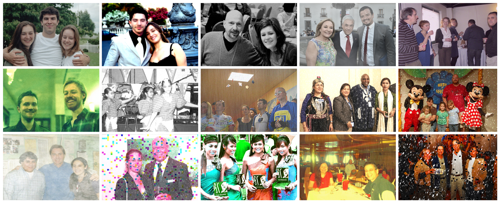

# OpenForensics: Large-Scale Challenging Dataset For Multi-Face Forgery Detection And Segmentation In-The-Wild



## Overview:

OpenForensics dataset is specifically designed for multi-face forgery detection and segmentation tasks. 
The version 1.0.0 consists of 115K in-the-wild images with 334K human faces. 
All images have face-wise rich annotations, such as forgery category, bounding box, segmentation mask, 
forgery boundary, and general facial landmarks.
OpenForensics dataset has great potentials for research in both deepfake prevention and general human 
face detection.

For more information, please consult our [ICCV 2021 Paper](https://openaccess.thecvf.com/content/ICCV2021/html/Le_OpenForensics_Large-Scale_Challenging_Dataset_for_Multi-Face_Forgery_Detection_and_Segmentation_ICCV_2021_paper.html).

- [Project Page](https://sites.google.com/view/ltnghia/research/openforensics)
- [Presentation](https://www.youtube.com/watch?v=bO__OcpESuI) at ICCV 2021


## Download:

<!--- [Extended Version](https://arxiv.org/abs/2107.14480) -->

- Dataset: [OpenForensics-V.1.0.0](https://zenodo.org/record/5528418)
- Baseline Models: [Google Drive](https://sites.google.com/view/ltnghia/research/openforensics) (Coming soon)

## Install

> pip install pycocotools

## Running
 
### Visualization

- Install: https://github.com/ltnghia/video-maskrcnn

> python visualization.py

### Evaluation

Evaluate results of detection/segmentation models (json file):
> python evaluation.py

### Data Augmentation
Generate more augmented data from normal images:
> pip install imagecorruptions
> 
> pip install six numpy scipy Pillow matplotlib scikit-image opencv-python imageio 
> 
> pip install --no-dependencies imgaug

> python augmentation.py

## Citations

If you use our dataset or source code in your research, 
please consider citing the following BibTeX entries:

```BibTeX

@ Inproceedings{ltnghia-ICCV2021,
  Title          = {OpenForensics: Large-Scale Challenging Dataset For Multi-Face Forgery Detection And Segmentation In-The-Wild},
  Author         = {Trung-Nghia Le and Huy H. Nguyen and Junichi Yamagishi and Isao Echizen},
  BookTitle      = {International Conference on Computer Vision},
  Year           = {2021}, 
}
```

and relevant publications:
```BibTeX

@Article{Kuznetsova-IJCV2020,
  Author = {Alina Kuznetsova and Hassan Rom and Neil Alldrin and Jasper Uijlings and Ivan Krasin and Jordi Pont-Tuset and Shahab Kamali and Stefan Popov and Matteo Malloci and Alexander Kolesnikov and Tom Duerig and Vittorio Ferrari},
  Title = {The Open Images Dataset V4: Unified image classification, object detection, and visual relationship detection at scale},
  Journal = {International Journal of Computer Vision},
  Year = {2020},
}

@Inproceedings{Oksuz-ECCV2018,
  Title          = {Localization Recall Precision (LRP): A New Performance Metric for Object Detection},
  Author         = {Oksuz, Kemal and Cam, Baris and Akbas, Emre and Kalkan, Sinan},
  Booktitle      = {European Conference on Computer Vision},
  Year           = {2018},
}

```

## License

The project is used for academic purpose only.


## Acknowledgement

This work is built on top of [Google Open Images](https://storage.googleapis.com/openimages/web/index.html).

## Changelog
- 09.2021: Release of OpenForensics-v.1.0.0
- 10.2021: Paper presentation at ICCV 2021

## Contact

If you have any questions, please contact [Trung-Nghia Le](https://sites.google.com/view/ltnghia).
